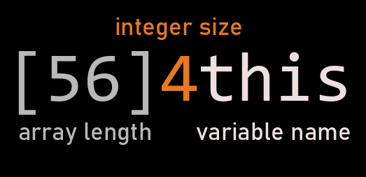

# Ice

Ice is a compiled language with pythonic code blocks. The fundamental data structures are unsigned integers, static and dynamic arrays, typed and void pointers and structs.

## Basic types

The type of a variable is stated with type prefixes as below.

1. **Integers**: An integer is prefixed with a digit `0-6`. The integer will use the number of bits equal to two raised to the power of the prefixed number.
	
	| Prefix | Number of bits |
	| ------ | -------------- |
	| 0      | 1              |
	| 1      | 2              |
	| 2      | 4              |
	| 3      | 8              |
	| 4      | 16             |
	| 5      | 32             |
	| 6      | 64             |
	
2. **Static Arrays**: The integer size prefix can be prefixed with a number enclosed in square brackets to declare a static array of that length. You can prefix this similarly many times to create multidimensional arrays.
     

3. **Dynamic arrays**: Using a digit `0-6` instead of the enclosed number makes it a dynamic array. The digit refers to the size of the integer used to store the length of the array (similar to the number of bits used for an integer using the integer size prefix)

4. **Typed pointers**: *(Look. 99.9% of all the code I've written is in python. So if I do something stupid with pointers and stuff, don't laugh)*
     Prefixing this sequence of digits and brackets with an asterisk makes it a pointer (`*[56]4that`). Dynamic arrays are always pointers and they store the address along with the array length. The compiler knows the type information and is not stored during run-time.

5. **Void Pointers**: Prefixing the integer size prefix with a carat `^` makes it a void pointer that stores the size and the address of the data pointed to.

6. **Structs**: Replacing the integer size prefix with comma separated type prefixes enclosed within parenthesis makes a struct. *(i might make it so you can name the fields of a struct)*

### Ownership of pointers

Every pointer has an ownership bit which tells whether it owns the data. If a pointer that owns data goes out of scope, the pointed data is dereferenced. Also, when an owning pointer is assigned different data, the owned data is also dereferenced.

Ownership only can be *transferred* from pointer to pointer, and not copied. This makes pointers unique owners. (There exists a workaround though, but why would I share methods of causing unintended behaviour.)

### Assignments

Here is the place-holder syntax for the different types of assignments:

```lua
varL = varR          -- `varL` gets the data of `varR`
varL = pointerR      -- `varL` gets the data `pointerR` points to
pointerL = varR      -- `pointerL` points to `varR`
pointerL = pointerR  -- `pointerL` points to the data `pointerR` points to
pointerL := pointerR -- `pointerL` points to the data `pointerR` points to and ownership is transferred
pointerL -> pointerR -- data pointed by `pointerR` gets data pointed by `pointerL`
```

## Labels

A label is compile-time metadata of a variable which tells the compiler the methods of a variable. This introduces an object-oriented aspect with absolutely no sacrifice in run-time performance.